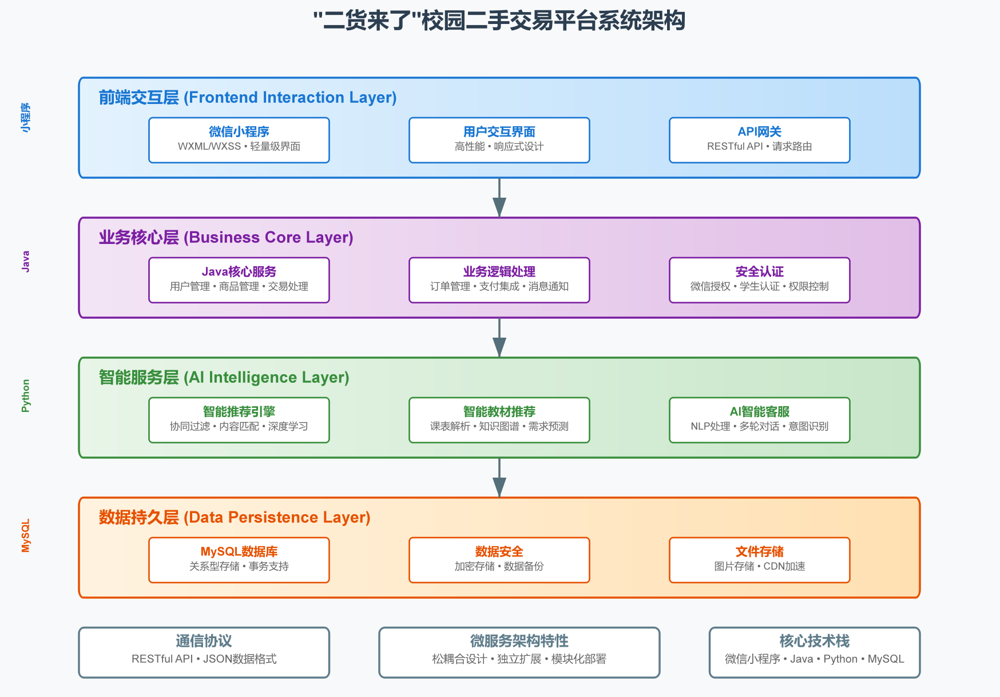

# 贰货来了

## 项目愿景

"二货来了"是一款专为高校学生打造的新一代智能化校园二手交易平台，致力于通过前沿技术重塑校园二手交易生态，让闲置资源流转更加高效、精准、智能。我们不仅仅是一个交易平台，更是校园资源优化配置的智能引擎，通过AI赋能，让每一件二手物品都能找到最需要它的人。

## 系统架构

"二货来了"采用前后端分离的微服务架构设计，由四大核心模块组成的分布式系统：

1. **前端交互层**：基于微信小程序构建，提供轻量级、高性能的用户交互界面
2. **业务核心层**：基于Java构建的主服务系统，处理核心业务逻辑和数据流
3. **智能服务层**：基于Python构建的AI服务集群，提供智能推荐、智能客服等功能
4. **数据持久层**：基于MySQL的关系型数据库，保障数据安全与高效存取

系统各层之间通过RESTful API进行通信，采用松耦合设计，确保各模块可独立扩展与优化。特别是智能服务层采用了独立部署的微服务架构，可根据业务需求灵活扩展算法模型与计算资源。

## 技术栈优势

### 前端技术栈

- **微信小程序**：无需下载安装，即用即走，大幅降低用户使用门槛
- **WXML/WXSS**：提供原生级别的用户体验与性能表现
- **原生组件库**：确保界面设计符合微信生态体验标准，提升用户亲和度

### 后端技术栈

- **Java核心框架**：稳定可靠的业务处理能力，成熟的企业级应用支持
- **RESTful API**：标准化的接口设计，便于跨平台集成与扩展
- **MySQL数据库**：高性能的数据存储与查询，完善的事务支持与数据一致性保障

### 智能服务技术栈

- **Python + FastAPI**：高性能异步API框架，处理高并发推荐请求
- **SQLAlchemy ORM**：优雅高效的数据库交互，简化数据操作
- **Scikit-learn**：强大的机器学习算法库，支持多种推荐算法实现
- **Pandas/NumPy**：高效的数据处理与科学计算库，加速特征工程与模型训练

### 微服务架构优势

- **技术栈独立性**：各服务可选用最适合其业务特性的技术栈
- **弹性伸缩能力**：智能服务可独立扩展，应对高峰期计算需求
- **容错性设计**：单一服务故障不影响整体系统运行
- **迭代升级便捷**：可针对单一服务进行升级而不影响其他模块

## 核心功能亮点

### 1. AI驱动的智能推荐引擎

"二货来了"平台核心竞争力之一是其多维度智能推荐系统，通过多层次的算法策略，为用户提供精准的商品推荐：

#### 基础推荐引擎

- **内容匹配算法**：基于商品类别、价格区间、地理位置等多维特征进行精准匹配
- **热度排序机制**：综合浏览量、收藏数、询问次数等多维指标，智能计算商品热度分值
- **时效性优化**：对新发布商品进行时效性加权，确保用户能及时发现新上架的优质商品

#### 进阶推荐策略（迭代规划）

- **向量化语义推荐**：通过NLP技术对商品描述进行语义向量化，实现深层次内容理解与匹配
- **协同过滤算法**：基于用户行为相似性，发掘潜在兴趣商品，突破类别限制
- **深度学习模型**：通过神经网络模型捕捉复杂非线性用户兴趣特征，实现更高精度推荐

### 2. 智能教材推荐系统

针对高校学生群体的独特需求，我们开发了行业首创的"智能教材推荐系统"：

- **课表解析引擎**：自动识别用户课程表，提取课程信息
- **教材知识图谱**：构建课程与教材的关联知识图谱，精准匹配教材需求
- **二手教材智能匹配**：根据课程进度、教材版本、价格偏好等多维度进行智能匹配
- **季节性预测**：根据学期开始时间提前预测教材需求高峰，优化推荐策略

这一功能极大地简化了学生寻找二手教材的过程，实现"我的课表即我的教材购物清单"的便捷体验。

### 3. AI智能客服助手

平台集成了基于先进NLP技术的智能客服系统——"小二"，为用户提供全天候、高效率的智能服务：

- **意图识别引擎**：精准理解用户问题类型，提供针对性解答
- **多轮对话能力**：支持上下文理解，实现连贯自然的交互体验
- **知识库自学习**：通过用户交互不断丰富知识库，提升回答准确度
- **人机协作模式**：复杂问题平滑转接人工客服，无缝衔接服务体验

"小二"不仅能解答平台使用问题，还能提供商品推荐、交易指导等增值服务，大幅提升用户体验与平台运营效率。

### 4. 用户行为分析与个性化服务

平台构建了完整的用户行为分析系统，通过数据驱动优化用户体验：

- **全链路行为跟踪**：记录浏览、收藏、询问、交易等全链路用户行为
- **用户画像构建**：基于行为数据构建多维度用户兴趣画像
- **个性化界面调优**：根据用户偏好动态调整界面元素与功能展示
- **智能提醒服务**：根据用户兴趣主动推送相关商品上新提醒

## 技术创新与未来展望

"二货来了"平台在技术实现上采用了"渐进式AI增强"策略，通过分阶段引入AI能力，确保系统稳定性与用户体验的平衡：

1. **基础阶段**：实现规则化的智能匹配与推荐，建立用户行为数据采集体系
2. **进阶阶段**：引入机器学习算法，实现基于内容的智能推荐与初步的用户画像
3. **高级阶段**：部署深度学习模型，实现协同过滤、知识图谱等高级智能特性

未来，我们将进一步探索以下技术方向：

- **多模态理解**：通过计算机视觉技术自动识别与分类商品图片
- **智能定价助手**：基于市场数据为卖家提供智能定价建议
- **AR虚拟试用**：通过AR技术实现部分商品的虚拟试用体验
- **区块链交易保障**：探索区块链技术在二手交易信用体系中的应用

## 结语

"二货来了"不仅是一个校园二手交易平台，更是AI技术在垂直场景中的创新应用典范。我们相信，通过技术创新与用户体验的不断优化，"二货来了"将重新定义校园二手交易，让闲置资源流转更加智能、高效、可持续，为建设绿色校园、智慧校园贡献力量。